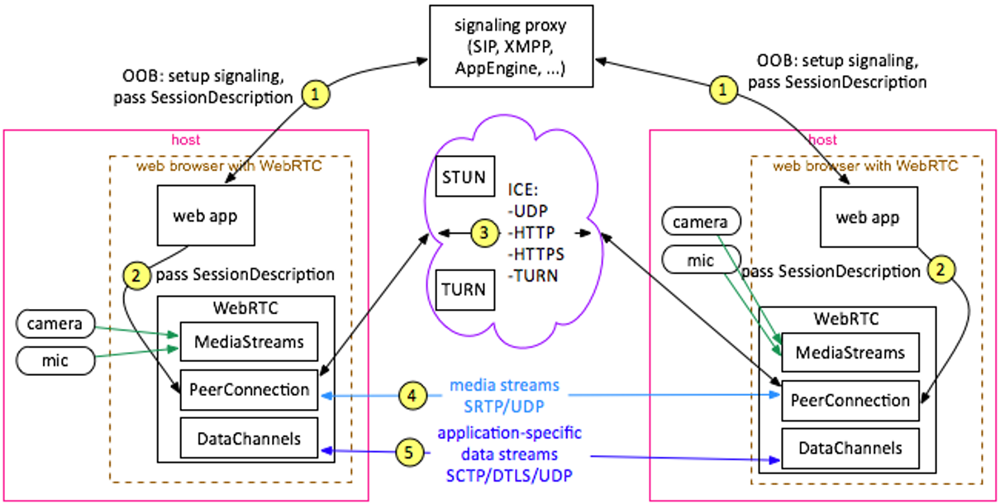

# WebRTC 是什么

一句话，用浏览器来进行实时通信

具体来说：

1. 它是一套基于 Web 进行实时通信的标准和参考实现

2. 它是一个开源项目，最初由 google 发起并交由开源社区

借助WebRTC，你可以在基于开放标准的应用程序中添加实时通信功能。 它支持在节点之间发送视频，语音和通用数据，从而使开发人员能够构建功能强大的语音和视频通信解决方案。 该技术可在所有现代浏览器以及所有主要平台的本机客户端上使用。

WebRTC背后的技术被实现为一个开放的Web标准，并在所有主要浏览器中均以常规JavaScript API的形式提供。 对于本机客户端（例如Android和iOS应用程序），可以使用提供相同功能的库。

* W3C 的 Web Real-Time Communication Working Group (WEBRTC) 负责制定 Web API 供各大浏览器厂商跟进。

* IETF 的 Real-Time Communication in Web-browser (RTCWEB) 负责制定协议，数据格式，安全及其他底层通信所需的内容。

# WebRTC 能干什么

* 媒体源的捕捉: 麦克风，摄像头, 以及屏幕显示的捕捉
  - API: navigator.mediaDevices.getUserMedia()
  - API: navigator.mediaDevices.getDisplayMedia()

* 媒体的协商和传输: 通过 IP 网络传输音频，视频及数据 - Voice/Video/Data over IP
  - API: RTCPeerConnection
  - API: RTCDataChannel
  
* 媒体的渲染: 音频，视频及数据在本地设备上的播放或渲染

```
  attachMediaStream: function(element, stream) {
    logging('DEPRECATED, attachMediaStream will soon be removed.');
    element.srcObject = stream;
  }
```




# 为什么需要制定 WebRTC 标准和由浏览器来提供这些 API


