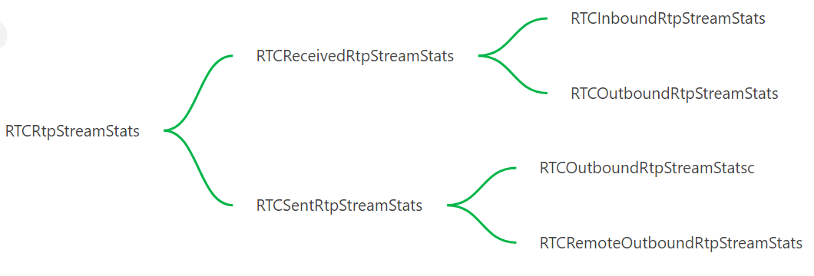

# WebRTC Statistics

WebRTC 支持对于连接和媒体传输和处理相关的统计信息.

https://developer.mozilla.org/en-US/docs/Web/API/WebRTC_Statistics_API


```javascript

try {
  myPeerConnection = new RTCPeerConnection(pcOptions);

  statsInterval = window.setInterval(getConnectionStats, 1000);
  /* add event handlers, etc */
} catch(err) {
  console.error("Error creating RTCPeerConnection: " + err);
}

function getConnectionStats() {
  myPeerConnection.getStats(null).then(stats => {
    var statsOutput = "";

    stats.forEach(report => {
      if (report.type === "inbound-rtp" && report.kind === "video") {
        Object.keys(report).forEach(statName => {
          statsOutput += `<strong>${statName}:</strong> ${report[statName]}<br>\n`;
        });
      }
    });

    document.querySelector(".stats-box").innerHTML = statsOutput;
  });
}


```

# WebRTC 统计类型 RTCStatsType

* codec
* Inbound-rtp
* outbound-rtp
* remote-inbound-rtp
* Remote-outbound-rtp
* csrc
* peer-connection
* data-channel
* stream
* track
* transceiver
* sender
* receiver
* transport
* sctp-transport
* candidate-pair
* local-candidate
* remote-candidate
* certificate
* ice-server


##  RTP statistics hierarchy
* RTCRtpStreamStats
  * RTCReceivedRtpStreamStats
    - RTCInboundRtpStreamStats
    - RTCRemoteInboundRtpStreamStats

  * RTCSentRtpStreamStats
    - RTCOutboundRtpStreamStatsc
    - RTCRemoteOutboundRtpStreamStats



## codec

Statistics for a codec that is currently being used by RTP streams being sent or received by this RTCPeerConnection object. It is accessed by the RTCCodecStats.

```javascript
dictionary RTCCodecStats : RTCStats {
             required unsigned long payloadType;
             RTCCodecType  codecType;
             required DOMString     transportId;
             required DOMString     mimeType;
             unsigned long clockRate;
             unsigned long channels;
             DOMString     sdpFmtpLine;
};
```

## inbound-rtp
Statistics for an inbound RTP stream that is currently received with this RTCPeerConnection object. It is accessed by the RTCInboundRtpStreamStats.

```javascript

dictionary RTCInboundRtpStreamStats : RTCReceivedRtpStreamStats {
             required DOMString   receiverId;
             DOMString            remoteId;
             unsigned long        framesDecoded;
             unsigned long        keyFramesDecoded;
             unsigned long        frameWidth;
             unsigned long        frameHeight;
             unsigned long        frameBitDepth;
             double               framesPerSecond;
             unsigned long long   qpSum;
             double               totalDecodeTime;
             double               totalInterFrameDelay;
             double               totalSquaredInterFrameDelay;
             boolean              voiceActivityFlag;
             DOMHighResTimeStamp  lastPacketReceivedTimestamp;
             double               averageRtcpInterval;
             unsigned long long   headerBytesReceived;
             unsigned long long   fecPacketsReceived;
             unsigned long long   fecPacketsDiscarded;
             unsigned long long   bytesReceived;
             unsigned long long   packetsFailedDecryption;
             unsigned long long   packetsDuplicated;
             record<USVString, unsigned long long> perDscpPacketsReceived;
             unsigned long        nackCount;
             unsigned long        firCount;
             unsigned long        pliCount;
             unsigned long        sliCount;
             double               totalProcessingDelay;
             DOMHighResTimeStamp  estimatedPlayoutTimestamp;
             double               jitterBufferDelay;
             unsigned long long   jitterBufferEmittedCount;
             unsigned long long   totalSamplesReceived;
             unsigned long long   totalSamplesDecoded;
             unsigned long long   samplesDecodedWithSilk;
             unsigned long long   samplesDecodedWithCelt;
             unsigned long long   concealedSamples;
             unsigned long long   silentConcealedSamples;
             unsigned long long   concealmentEvents;
             unsigned long long   insertedSamplesForDeceleration;
             unsigned long long   removedSamplesForAcceleration;
             double               audioLevel;
             double               totalAudioEnergy;
             double               totalSamplesDuration;
             unsigned long        framesReceived;
             DOMString            decoderImplementation;
            };
```


## outbound-rtp
Statistics for an outbound RTP stream that is currently sent with this RTCPeerConnection object. It is accessed by the RTCOutboundRtpStreamStats.

When there are multiple RTP streams connected to the same sender due to using simulcast, there will be one RTCOutboundRtpStreamStats per RTP stream, with distinct values of the ssrc member, and all these senders will have a reference to the same "sender" object (of type RTCAudioSenderStats or RTCVideoSenderStats) and "track" object (of type RTCSenderAudioTrackAttachmentStats or RTCSenderVideoTrackAttachmentStats). RTX streams do not show up as separate RTCOutboundRtpStreamStats objects but affect the packetsSent, bytesSent, retransmittedPacketsSent and retransmittedBytesSent counters of the relevant RTCOutboundRtpStreamStats objects.


```javascript
dictionary RTCOutboundRtpStreamStats : RTCSentRtpStreamStats {
             unsigned long        rtxSsrc;
             DOMString            mediaSourceId;
             DOMString            senderId;
             DOMString            remoteId;
             DOMString            rid;
             DOMHighResTimeStamp  lastPacketSentTimestamp;
             unsigned long long   headerBytesSent;
             unsigned long        packetsDiscardedOnSend;
             unsigned long long   bytesDiscardedOnSend;
             unsigned long        fecPacketsSent;
             unsigned long long   retransmittedPacketsSent;
             unsigned long long   retransmittedBytesSent;
             double               targetBitrate;
             unsigned long long   totalEncodedBytesTarget;
             unsigned long        frameWidth;
             unsigned long        frameHeight;
             unsigned long        frameBitDepth;
             double               framesPerSecond;
             unsigned long        framesSent;
             unsigned long        hugeFramesSent;
             unsigned long        framesEncoded;
             unsigned long        keyFramesEncoded;
             unsigned long        framesDiscardedOnSend;
             unsigned long long   qpSum;
             unsigned long long   totalSamplesSent;
             unsigned long long   samplesEncodedWithSilk;
             unsigned long long   samplesEncodedWithCelt;
             boolean              voiceActivityFlag;
             double               totalEncodeTime;
             double               totalPacketSendDelay;
             double               averageRtcpInterval;
             RTCQualityLimitationReason                 qualityLimitationReason;
             record<DOMString, double> qualityLimitationDurations;
             unsigned long        qualityLimitationResolutionChanges;
             record<USVString, unsigned long long> perDscpPacketsSent;
             unsigned long        nackCount;
             unsigned long        firCount;
             unsigned long        pliCount;
             unsigned long        sliCount;
             DOMString            encoderImplementation;
};
```

## remote-inbound-rtp

Statistics for the remote endpoint's inbound RTP stream corresponding to an outbound stream that is currently sent with this RTCPeerConnection object. It is measured at the remote endpoint and reported in an RTCP Receiver Report (RR) or RTCP Extended Report (XR). It is accessed by the RTCRemoteInboundRtpStreamStats.

```javascript
dictionary RTCRemoteInboundRtpStreamStats : RTCReceivedRtpStreamStats {
             DOMString            localId;
             double               roundTripTime;
             double               totalRoundTripTime;
             double               fractionLost;
             unsigned long long   reportsReceived;
             unsigned long long   roundTripTimeMeasurements;
};

```

## remote-outbound-rtp
Statistics for the remote endpoint's outbound RTP stream corresponding to an inbound stream that is currently received with this RTCPeerConnection object. It is measured at the remote endpoint and reported in an RTCP Sender Report (SR). It is accessed by the RTCRemoteOutboundRtpStreamStats.

## media-source
Statistics for the media produced by a MediaStreamTrack that is currently attached to an RTCRtpSender. This reflects the media that is fed to the encoder; after getUserMedia() constraints have been applied (i.e. not the raw media produced by the camera). It is either an RTCAudioSourceStats or RTCVideoSourceStats depending on its kind.

## csrc
Statistics for a contributing source (CSRC) that contributed to an inbound RTP stream. It is accessed by the RTCRtpContributingSourceStats.

## peer-connection
Statistics related to the RTCPeerConnection object. It is accessed by the RTCPeerConnectionStats.

## data-channel
Statistics related to each RTCDataChannel id. It is accessed by the RTCDataChannelStats.

## stream
This is now obsolete. Contains statistics related to a specific MediaStream. It is accessed by the obsolete dictionary RTCMediaStreamStats.

## track
Statistics related to a specific MediaStreamTrack's attachment to an RTCRtpSender and the corresponding media-level metrics. It is accessed by RTCSenderVideoTrackAttachmentStats, RTCSenderAudioTrackAttachmentStats, RTCReceiverVideoTrackAttachmentStats or RTCReceiverAudioTrackAttachmentStats, all inherited from RTCMediaHandlerStats.

The monitored "track" object is deleted when the sender it reports on has its track value changed to no longer refer to the same track.

NOTE
All "track" stats have been made obsolete. The relevant metrics have been moved to "media-source", "sender", "outbound-rtp", "receiver" and "inbound-rtp" stats.

## transceiver
Statistics related to a specific RTCRtpTransceiver. It is accessed by the RTCRtpTransceiverStats dictionary.

## sender
Statistics related to a specific RTCRtpSender and the corresponding media-level metrics. It is accessed by the RTCAudioSenderStats or the RTCVideoSenderStats depending on kind.

## receiver
Statistics related to a specific receiver and the corresponding media-level metrics. It is accessed by the RTCAudioReceiverStats or the RTCVideoReceiverStats depending on kind.

## transport
Transport statistics related to the RTCPeerConnection object. It is accessed by the RTCTransportStats.

```javascript
dictionary RTCTransportStats : RTCStats {
             unsigned long long    packetsSent;
             unsigned long long    packetsReceived;
             unsigned long long    bytesSent;
             unsigned long long    bytesReceived;
             DOMString             rtcpTransportStatsId;
             RTCIceRole            iceRole;
             DOMString             iceLocalUsernameFragment;
             required RTCDtlsTransportState dtlsState;
             RTCIceTransportState  iceState;
             DOMString             selectedCandidatePairId;
             DOMString             localCertificateId;
             DOMString             remoteCertificateId;
             DOMString             tlsVersion;
             DOMString             dtlsCipher;
             DOMString             srtpCipher;
             DOMString             tlsGroup;
             unsigned long         selectedCandidatePairChanges;
};
```

## sctp-transport
SCTP transport statistics related to an RTCSctpTransport object. It is accessed by the RTCSctpTransportStats dictionary.

## candidate-pair
ICE candidate pair statistics related to the RTCIceTransport objects. It is accessed by the RTCIceCandidatePairStats.

A candidate pair that is not the current pair for a transport is deleted when the RTCIceTransport does an ICE restart, at the time the state changes to "new". The candidate pair that is the current pair for a transport is deleted after an ICE restart when the RTCIceTransport switches to using a candidate pair generated from the new candidates; this time doesn't correspond to any other externally observable event.

## local-candidate
ICE local candidate statistics related to the RTCIceTransport objects. It is accessed by the RTCIceCandidateStats for the local candidate.

A local candidate is deleted when the RTCIceTransport does an ICE restart, and the candidate is no longer a member of any non-deleted candidate pair.

## remote-candidate
ICE remote candidate statistics related to the RTCIceTransport objects. It is accessed by the RTCIceCandidateStats for the remote candidate.

A remote candidate is deleted when the RTCIceTransport does an ICE restart, and the candidate is no longer a member of any non-deleted candidate pair.

## certificate
Information about a certificate used by an RTCIceTransport. It is accessed by the RTCCertificateStats.

## ice-server
Information about the connection to an ICE server (e.g. STUN or TURN). It is accessed by the RTCIceServerStats.

