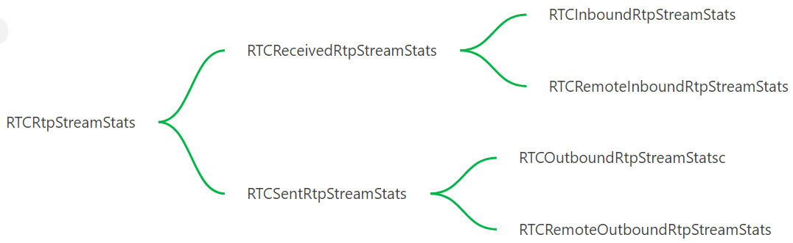

# WebRTC's Statistics

## RTCStatsType

* codec
* Inbound-rtp
* outbound-rtp
* remote-inbound-rtp
* Remote-outbound-rtp
* csrc
* peer-connection
* data-channel
* stream
* track
* transceiver
* sender
* receiver
* transport
* sctp-transport
* candidate-pair
* local-candidate
* remote-candidate
* certificate
* ice-server

##  RTP statistics hierarchy
* RTCRtpStreamStats
  * RTCReceivedRtpStreamStats
    - RTCInboundRtpStreamStats
    - RTCRemoteInboundRtpStreamStats

  * RTCSentRtpStreamStats
    - RTCOutboundRtpStreamStatsc
    - RTCRemoteOutboundRtpStreamStats

