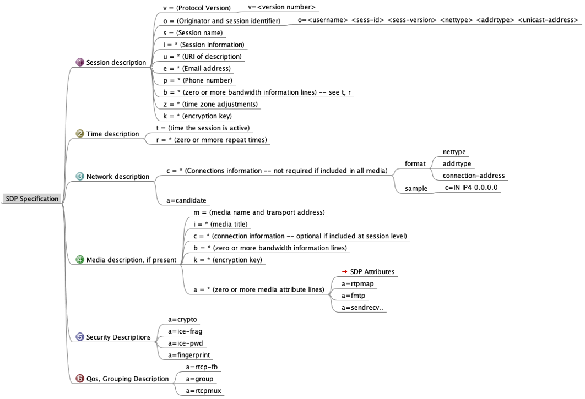

################
WebRTC 的信令
################

.. include:: ../links.ref
.. include:: ../tags.ref
.. include:: ../abbrs.ref

.. contents::
    :local:

overview
==============
signal 在英语中有两个不同的意思，一是信令，一是信号，这里我们主要讲信令。

信令的意思是呼叫流程的控制，包括媒体通道的搭建，媒体参数的协商，媒体流的控制。

在 WebRTC 中，信令控制主要的协议是 4 个

1. `WebRTC 1.0`_: Real-Time Communication Between Browsers， 即浏览器之间的实时通信标准

2. `JSEP`_ (Javascript Session Establishment Protocol) ， 即 Javascript 会话建立协议。

3. `SDP`_ (Session Decscription Protocol), 即会话描述协议

4. `ICE`_ (Interactive Connectivity Establishment)， 即交互式连接建立协议

前两者主要是描述了如何通过浏览器提供的 API 实现实时的音视频通讯，主要的接口，实体和方法是通过 `WebIDL`_ 来定义的

WebIDL
==================
WebIDL 是一种接口定义语言，用来定义由浏览器实现的接口。`WebIDL`_ 是一个 IDL 变体，具有许多特性，允许更容易地指定 Web 平台中常见脚本对象的行为。

其中的 IDL Fragment 接口定义语言片段有如下类型的定义：

* interfaces
* partial interface definitions
* interface mixins
* partial mixin definitions
* callback functions
* callback interfaces
* namespaces
* partial namespace definitions
* dictionaries
* partial dictionary definitions
* typedefs
* includes statements

每个定义（匹配 Definition）前面都可以有一个扩展属性列表（匹配 ExtendedAttributeList），它可以控制如何在语言绑定中处理定义

SDP
==============

媒体参数协商要通过 SDP (会话描述协议)， 它包括

* 会话名称和目的Session name and purpose 
* 会话存活的时间
* 会话中所包含媒体的信息（地址，端口，格式等等）

在 WebRTC 交互流程中，通信双方需要了解彼此的会话描述信息，也就是需要通过 Offer/Answer （提议/应答）机制来交换 SDP:
* 发起方都会通过调用 createOffer() API 创建 Offer。
* 然后，应用程序使用该 Offer 通过 setLocalDescription() API来设置其本地配置。offer 最终通过其首选的信令机制（例如WebSockets）发送到远程端；
* 收到该 offer 后，远程方将使用 setRemoteDescription()API进行安置。
* 为了完成 Offer/Answer 交换，接收方会使用 createAnswer() API生成适当的 answer，使用 setLocalDescription() API应用该 answer，并将 answer 通过信令通道发送回发起方。
* 发起方获得该`answer`后，它将使用 setRemoteDescription() API进行设置，并且初始设置已完成。可以重复此过程以进行其他 Offer/Answer 交换。

参见 `_RFC3264`_ : An Offer/Answer Model with the Session Description Protocol (SDP)

SDP 扩展
================

* DTLS fingerprint for SRTP (a=fingerprint) 
* RTP/RTCP Multiplexing (a=rtcp-mux) 
* RTCP Feedback support (a=rtcp-fb) 
* Host and server-reflexive candidate lines (a=candidate) 
* SRTP Setup framework parameters (a=setup) 
* RTCP attribute (a=rtcp) 
* RTP header extension indicating audio-levels from client to the mixer(a=extmap:1 urn:ietf:params:rtp-hdrext:ssrc-audio-level)

SDP 相关的扩展协议很多，不能一一列举，在 WebRTC 中有几个比较重要的

Source-Specific Media Attributes in SDP
------------------------------------------------------
参见 https://datatracker.ietf.org/doc/html/rfc5576 

Defines a mechanism to describe RTP sources, identified by their synchronization source (SSRC) identifier, in SDP, to associate attributes with these sources, and to express relationships among individual sources. 

::

    a=ssrc:<ssrc-id> <attribute> 
    a=ssrc:<ssrc-id> <attribute>:<value>
    a=ssrc-group:<semantics> <ssrc-id> ...

The Session Description Protocol (SDP) Grouping Framework
--------------------------------------------------------------
参见  https://datatracker.ietf.org/doc/html/rfc5888

* Use of "group" and "mid"
* Flow Identification (FID)
  
  - For each participant, the session is defined by a particular pair of destination transport addresses
  - But a single media instance maybe sent using more than one RTP session

Source-Specific Media Attributes in SDP
--------------------------------------------------------------
参见 https://datatracker.ietf.org/doc/html/rfc5576 

Defines a mechanism to describe RTP sources, identified by their synchronization source (SSRC) identifier, in SDP, to associate attributes with these sources, and to express relationships among individual sources. 

::

    a=ssrc:<ssrc-id> <attribute> 
    a=ssrc:<ssrc-id> <attribute>:<value>
    a=ssrc-group:<semantics> <ssrc-id> ...

更多的 SDP 实例说明请参见 `SDP for the WebRTC`_

参考资料
==============
* `Signaling and video calling`_
* `WebIDL Checker`_
* `_RFC3264`_: An Offer/Answer Model with the Session Description Protocol (SDP)
* `SDP for the WebRTC`_