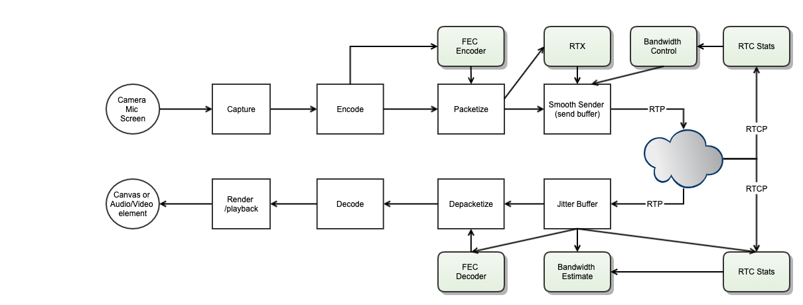

########################
WebRTC Transport
########################

.. include:: ../links.ref
.. include:: ../tags.ref
.. include:: ../abbrs.ref

============ ==========================
**Abstract** WebRTC Transport
**Authors**  Walter Fan
**Status**   WIP as draft
**Updated**  |date|
============ ==========================

.. |date| date::

.. contents::
   :local:

Overview
=========================

RTP 会话中会包含多路的媒体流 media stream，每一路流由 ssrc 这个 RTP 头域来标识。不过，SSRC 和媒体流的关联并不是恒定的.
在一个会话中，，这些 stream 可以用一些标识符来区分，包括 CNAMES, MSID（RFC8830）。

不幸的是，它们在同一时刻可能出现在多路流中，都不合适用来标识一个独立的媒体流

* RFC8852 RTP Stream Identifier Source Description (SDES) 定义了 RTCP 消息扩展
* RFC7941 RTP Header Extension for the RTP Control Protocol (RTCP) Source Description Items 中定义了相应的 RTP 头扩展

* RTCP "RtpStreamId" SDES Extension

.. code-block::

        0 1 2 3 4 5 6 7 8 9 0 1 2 3 4 5 6 7 8 9 0 1 2 3 4 5 6 7 8 9 0 1
       +-+-+-+-+-+-+-+-+-+-+-+-+-+-+-+-+-+-+-+-+-+-+-+-+-+-+-+-+-+-+-+-+
       |RtpStreamId=12 |     length    | RtpStreamId                 ...
       +-+-+-+-+-+-+-+-+-+-+-+-+-+-+-+-+-+-+-+-+-+-+-+-+-+-+-+-+-+-+-+-+

   The RtpStreamId payload is ASCII encoded and is not null terminated.

*  RTCP "RepairedRtpStreamId" SDES Extension

.. code-block::

        0 1 2 3 4 5 6 7 8 9 0 1 2 3 4 5 6 7 8 9 0 1 2 3 4 5 6 7 8 9 0 1
       +-+-+-+-+-+-+-+-+-+-+-+-+-+-+-+-+-+-+-+-+-+-+-+-+-+-+-+-+-+-+-+-+
       |Repaired...=13 |     length    | RepairRtpStreamId           ...
       +-+-+-+-+-+-+-+-+-+-+-+-+-+-+-+-+-+-+-+-+-+-+-+-+-+-+-+-+-+-+-+-+

术语
==================

*  CNAME: Canonical Endpoint Identifier, defined in [RFC3550]

*  MID: Media Identification, defined in [RFC8843]

*  MSID: MediaStream Identification, defined in [RFC8830]

*  RTCP: Real-time Transport Control Protocol, defined in [RFC3550]

*  RTP: Real-time Transport Protocol, defined in [RFC3550]

*  SDES: Source Description, defined in [RFC3550]

*  SSRC: Synchronization Source, defined in [RFC3550]

传输控制
==================

* Bandwidth estimation
* Send control
* Loas concealment
* AV sync

参考资料
====================
* `Understanding the Dynamic Behaviour of the Google Congestion Control for RTCWeb`_
* `GCC Analysis <https://www.aitrans.online/static/paper/Gcc-analysis.pdf>`_
* `RTP Extensions for Transport-wide Congestion Control`_
* `A Google Congestion Control Algorithm for Real-Time Communication`_

.. _RTP Extensions for Transport-wide Congestion Control: https://tools.ietf.org/html/draft-holmer-rmcat-transport-wide-cc-extensions-01
.. _A Google Congestion Control Algorithm for Real-Time Communication:  https://tools.ietf.org/html/draft-ietf-rmcat-gcc-02

.. _Understanding the Dynamic Behaviour of the Google Congestion Control for RTCWeb: https://ieeexplore.ieee.org/document/6691458