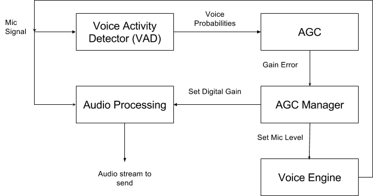

##########################
Automatic Gain Control
##########################

.. include:: ../links.ref
.. include:: ../tags.ref
.. include:: ../abbrs.ref

============ ==========================
**Abstract** Automatic Gain Control
**Authors**  Walter Fan
**Status**   WIP
**Updated**  |date|
============ ==========================

.. |date| date::

.. contents::
   :local:

概述
===================

自动增益控制（AGC）是指当直放站工作于最大增益且输出为最大功率时，增加输入信号电平，提高直放站对输出信号电平控制的能力。

自动增益控制主要用于调整音量幅值。

正常人交谈的音量在40~60dB之间，低于25dB的声音听起来很吃力，超过100dB的声音会让人不适。AGC的作用就是将音量调整到人接受的范围。

AGC的调整分为模拟部分和数字部分，模拟部分是麦克风的采集增益，数字部分是音频数据的数字电平调整。

