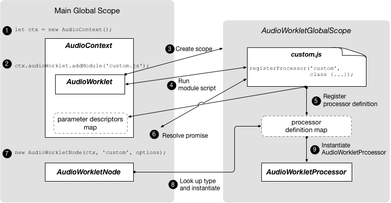

##################
Audio worklet
##################

.. include:: ../links.ref
.. include:: ../tags.ref
.. include:: ../abbrs.ref

.. contents::
    :local:

Overview
=========================

Using Audio Worklet consists of two parts: AudioWorkletProcessor and AudioWorkletNode. 

This is more involved than using ScriptProcessorNode, but it is needed to give developers the low-level capability for custom audio processing. 

AudioWorkletProcessor represents the actual audio processor written in JavaScript code, and it lives in the AudioWorkletGlobalScope. 

AudioWorkletNode is the counterpart of AudioWorkletProcessor and takes care of the connection to and from other AudioNodes in the main thread. It is exposed in the main global scope and functions like a regular AudioNode.

an AudioContext object and the processor name as a string. A processor definition can be loaded and registered by the new Audio Worklet object's addModule() call. 

.. image:: ../_static/webaudio-1.svg

Terms
========================

* BaseAudioContext: Web Audio API's primary object.

* Audio Worklet: A special script file loader for the Audio Worklet operation. Belongs to * * 

* BaseAudioContext. A BaseAudioContext can have one Audio Worklet. The loaded script file is evaluated in the AudioWorkletGlobalScope and is used to create the AudioWorkletProcessor instances.

* AudioWorkletGlobalScope : A special JS global scope for the Audio Worklet operation. Runs on a dedicated rendering thread for the WebAudio. A BaseAudioContext can have one AudioWorkletGlobalScope.

* AudioWorkletNode : An AudioNode designed for the Audio Worklet operation. Instantiated from a BaseAudioContext. A BaseAudioContext can have multiple AudioWorkletNodes similarly to the native AudioNodes.

* AudioWorkletProcessor : A counterpart of the AudioWorkletNode. The actual guts of the AudioWorkletNode processing the audio stream by the user-supplied code. It is instantiated in the AudioWorkletGlobalScope when a AudioWorkletNode is constructed. An AudioWorkletNode can have one matching AudioWorkletProcessor.

Mechanism
========================

Processing audio
-------------------------

An example algorithm of creating a custom audio processing mechanism is:

1. Create a separate file;
In the file:
Extend the AudioWorkletProcessor class (see "Deriving classes" section) and supply your own process() method in it;

2. Register the processor using AudioWorkletGlobalScope.registerProcessor() method;

3. Load the file using addModule() method on your audio context's audioWorklet property;

4. Create an AudioWorkletNode based on the processor. The processor will be instantiated internally by the AudioWorkletNode constructor.

5. Connect the node to the other nodes.

Process Method
--------------------------

Note: Currently, audio data blocks are always 128 frames long—that is, they contain 128 32-bit floating-point samples for each of the inputs' channels. However, plans are already in place to revise the specification to allow the size of the audio blocks to be changed depending on circumstances (for example, if the audio hardware or CPU utilization is more efficient with larger block sizes). Therefore, you must always check the size of the sample array rather than assuming a particular size.

This size may even be allowed to change over time, so you mustn't look at just the first block and assume the sample buffers will always be the same size.

Parameters
~~~~~~~~~~~~~~~~~~~~~~~~~~~
* inputs

An array of inputs connected to the node, each item of which is, in turn, an array of channels. Each channel is a Float32Array containing 128 samples. For example, inputs[n][m][i] will access n-th input, m-th channel of that input, and i-th sample of that channel.

* outputs

An array of outputs that is similar to the inputs parameter in structure. It is intended to be filled during the execution of the process() method. Each of the output channels is filled with zeros by default — the processor will output silence unless the output arrays are modified.

Example
=========================

First, we need to define a custom AudioWorkletProcessor, which will output white noise, and register it. Note that this should be done in a separate file.

.. code-block::

    // white-noise-processor.js
    class WhiteNoiseProcessor extends AudioWorkletProcessor {
        process (inputs, outputs, parameters) {
            const output = outputs[0]
            output.forEach(channel => {
            for (let i = 0; i < channel.length; i++) {
                channel[i] = Math.random() * 2 - 1
            }
            })
            return true
        }
    }

    registerProcessor('white-noise-processor', WhiteNoiseProcessor)

Next, in our main script file we'll load the processor, create an instance of AudioWorkletNode, passing it the name of the processor, then connect the node to an audio graph.

.. code-block::

    const audioContext = new AudioContext()
    await audioContext.audioWorklet.addModule('white-noise-processor.js')
    const whiteNoiseNode = new AudioWorkletNode(audioContext, 'white-noise-processor')
    whiteNoiseNode.connect(audioContext.destination)

Design Patterns
=========================

Using Audio Worklet with WebAssembly
----------------------------------------

The combination of these two features brings a variety of advantages to audio processing on the web, but the two biggest benefits are: 
a) bringing existing C/C++ audio processing code into the WebAudio ecosystem and 
b) avoiding the overhead of JS JIT compilation and garbage collection in the audio processing code.

refe to `Audio Worklet Design Pattern`_

Reference
=========================
* `AudioWorkletNode`_
* `Enter Audio Worklet`_

.. _Audio Worklet Design Pattern: https://developers.google.com/web/updates/2018/06/audio-worklet-design-pattern
.. _AudioWorkletNode: https://webaudio.github.io/web-audio-api/#AudioWorkletNode
.. _Enter Audio Worklet: https://developers.google.com/web/updates/2017/12/audio-worklet