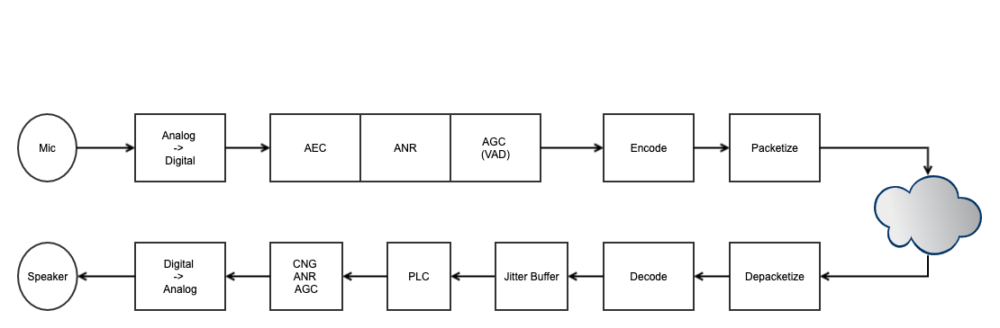

################
WebRTC 音频
################

.. toctree::
   :maxdepth: 1
   :caption: 目录

   audio_basic
   audio_level
   audio_api
   audio_qos
   audio_aec
   audio_vad
   audio_agc
   audio_ans
   
   audio_worklet
   audio_quality
   audio_analysis
   opus

.. include:: ../links.ref
.. include:: ../tags.ref
.. include:: ../abbrs.ref

============ ==========================
**Abstract** Web 音频
**Authors**  Walter Fan
**Status**   WIP
**Updated**  |date|
============ ==========================

.. |date| date::

Overview
===================

* Audio Capture by OS framework
* Audio data processing: AEC, ANR, AGC, etc.
* Active Speaker Arbitration, Selection and Notification based on Audio Level
* Audio data transimission
* Audio mixer

PLC
========================

一般方法
-----------------------------
PLC(Packet Loss concealment): 包丢失隐藏，是一种在VOIP通信中最小化语音数据包丢失带来的影响的技术。目录的PLC主要有三种技术：

* Zero insertion(插入零或者静音包)：丢失的语音帧使用0代替。这样虽然解决带来丢失的语音帧，但是带来的后果是通话的静音现象；
* Waveform subsititution(波形替换)：丢失的语音帧使用已经接收到的语音进行替换（因为语音在比较短的时间内是相对固定的）。最简单的是使用上一次接收到的语音帧进行替换；
* Model-based methods（基于模型的方法）：引入了一些算法，这些算法利用语音的内插和外插间隙的特性产生语音帧，取代丢失的语音帧；这种方法比较复杂。

处理算法
--------------------------
* replace the packet by mute signal (not good)
* repeat last packet
* interpolate samples by last packet and next packet

Reference
===================
* `RFC7874`_ "WebRTC Audio Codec and Processing Requirements" 
* http://en.wikipedia.org/wiki/Packet_loss_concealment