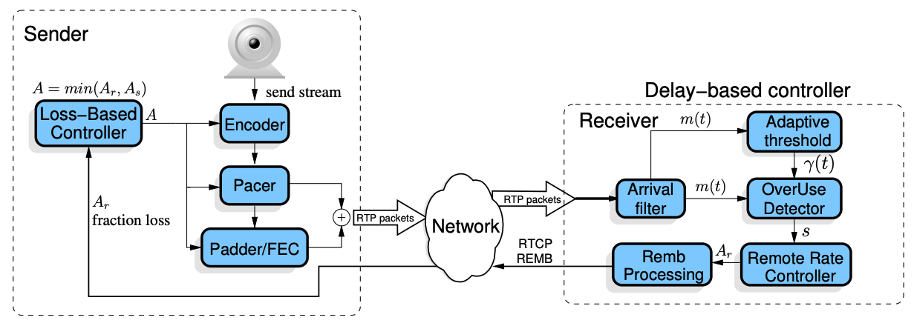
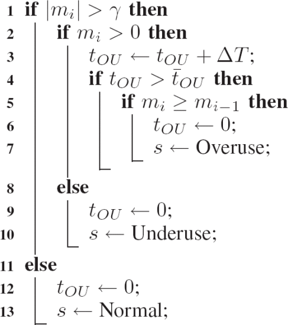

:orphan:

################################
Google Congestion Control
################################

.. include:: ../links.ref
.. include:: ../tags.ref
.. include:: ../abbrs.ref

============ ==========================
**Abstract** WebRTC RTP 拥塞控制
**Authors**  Walter Fan
**Status**   WIP
**Updated**  |date|
============ ==========================

.. |date| date::

.. contents::
   :local:

简介
=========================

GCC [#]_ 拥塞控制算法根据估计的拥塞状态调节发送速率。 为了估计状态，GCC 采用了一种有限状态机，该状态机由通过比较测得的单向延迟变化与动态阈值而获得的信号来驱动。

简而言之，当瓶颈被估计为“未充分利用 underused”时，发送速率就会增加； 当估计为“过度使用 overused”时，发送速率会降低。 当 GCC 流与 TCP 流共享瓶颈时，使用动态阈值来估计拥塞状态是解决饥饿问题的关键设计要求。

主要有两种方法:

* 接收端控制器计算接收的比特率 :math:`A_r`, 并将它发回给发送端，采用的算法是基于延迟的，估算出带宽会通过 REMB 消息发回给发送端
  
* 发送端控制器计算出不超过的 :math:`A_r` 的目标发送比特率，采用的算法有早期基于丢包的算法，也有后期推荐的基于延迟的算法

除了 RFC草案 `A Google Congestion Control Algorithm for Real-Time Communication`_ 有详细阐述，在 IEEE 发布的文章 “Understanding the Dynamic Behaviour of the Google Congestion Control for RTCWeb” [#]_ 亦有所探讨。

基于丢包的算法

数学符号约定
----------------------------------------

* X_bar 变量 X，其中 X 是向量 - 通常由变量名称加上顶部的横线。

* X_hat 对变量 X 真实值的估计 - 通常由变量名称加上顶部的抑扬音调符号标记。

* X(i) 向量 X 的“第 i”个值 - 通常由下标 i 标记。

* [x y z] 由元素 x、y 和 z 组成的行向量。

* X_bar^T 向量 X_bar 的转置。

* E{X} 随机变量 X 的期望值

1. 系统模型
=======================================

      GCC Architecture

3. 反馈和扩展
========================================

* 接收端：使用基于延迟的控制器， 可采用 RTP 扩展头 “abs_send_time”
* 发送端：使用基于丢包的控制器， 可采用 `Google REMB <webrtc_remb.html>`_ 反馈估算的最大带宽和 RTCP Receiver Report 来反馈丢包及用来计算 RTT
   

4. 发送引擎
=======================================

步行者 `Pacing` 用来驱动由控制器计算出的目标比特率

当媒体编码器产生数据时，会被送往一个步行者队列 (Pacer queue). 步行者 (Pacer) 每隔 burst_time 发送一组数据包到网络上。
推荐的 burst_time 为 5ms, 一组数据包的大小计算为目标比特率和 burst_time 的乘积。

5.  基于延迟的控制
=======================================

基于延迟的控制的算法主要分为四个部分：

1) pre-filtering 预先过滤
2) arrival-time filter 到达时间过滤器
3) over-use detector 过度使用检测器
4) rate-control 速率控制器

5.1 到达时间模型
-----------------------------------
两个包发送的间隔 T(i) – T(i-1) 和接收的间隔 t(i) – t(i-1) 在理想情况下是相同的，实际上会有不同.
也就是说包的到达时间并未保持稳定的速度。 在计算的时候可以用以帧分组，对两个组的到达时间进行计算。

* 发送时间间隔与到达时间间隔之间的延时的观测公式，称为单向延迟变化

.. math::   

   d(i) = t(i) – t(i-1) – (T(i) – T(i-1))

还可将数据包组之间的延迟变化建模为 

.. math::
    
    d(i) = w(i)

这里的 w(i) 是一个随机过程 W 的采样，它是一个连接容量，当前交叉流量和当前比特率的函数，我们将 W 建模为一个白高斯过程。如果我们过度使用了传输通道，则 w(i) 的平均值就会增大，如果网络路径中的拥塞队列已经清空了，这个 w(i) 的平均值就会减小，否则 w(i) 的平均值为零。

由此，我们可以将w(i) 分解为它的平均值加上一个偏差 

.. math::

    d(i) = m(i) + v(i)

v(i) 表示网络抖动和其他没有被这个模型捕捉到的延迟

5.2.  Pre-filtering 预先过滤
-----------------------------------------------------

预滤波旨在处理由信道中断引起的延迟瞬变。 在中断期间，由于与拥塞无关的原因，在网络缓冲区中排队的数据包会在中断结束时突发传送。

预过滤将突发到达的数据包组合并在一起。 如果满足以下两个条件之一，则数据包将合并到同一组中：

* 在一个 burst_time 间隔内发送的数据包序列构成一个组。

* 具有小于 burst_time 的到达间隔时间和小于0 的组间延迟变化d(i) 的数据包被认为是当前数据包组的一部分。

在 RTCP Sender Report 中有成对的 NTP timstamp 和 RTP timestamp， 这样就可以把 RTP 包中的 timestamp 转换为 NTP timstamp。

.. code-block::

                0                   1                   2                   3
                0 1 2 3 4 5 6 7 8 9 0 1 2 3 4 5 6 7 8 9 0 1 2 3 4 5 6 7 8 9 0 1
            +-+-+-+-+-+-+-+-+-+-+-+-+-+-+-+-+-+-+-+-+-+-+-+-+-+-+-+-+-+-+-+-+
     header |V=2|P|    RC   |   PT=SR=200   |             length            |
            +-+-+-+-+-+-+-+-+-+-+-+-+-+-+-+-+-+-+-+-+-+-+-+-+-+-+-+-+-+-+-+-+
            |                         SSRC of sender                        |
            +=+=+=+=+=+=+=+=+=+=+=+=+=+=+=+=+=+=+=+=+=+=+=+=+=+=+=+=+=+=+=+=+
     sender |              NTP timestamp, most significant word             |
     info   +-+-+-+-+-+-+-+-+-+-+-+-+-+-+-+-+-+-+-+-+-+-+-+-+-+-+-+-+-+-+-+-+
            |             NTP timestamp, least significant word             |
            +-+-+-+-+-+-+-+-+-+-+-+-+-+-+-+-+-+-+-+-+-+-+-+-+-+-+-+-+-+-+-+-+
            |                         RTP timestamp                         |
            +-+-+-+-+-+-+-+-+-+-+-+-+-+-+-+-+-+-+-+-+-+-+-+-+-+-+-+-+-+-+-+-+
            |                     sender's packet count                     |
            +-+-+-+-+-+-+-+-+-+-+-+-+-+-+-+-+-+-+-+-+-+-+-+-+-+-+-+-+-+-+-+-+
            |                      sender's octet count                     |
            +=+=+=+=+=+=+=+=+=+=+=+=+=+=+=+=+=+=+=+=+=+=+=+=+=+=+=+=+=+=+=+=+
     report |                 SSRC_1 (SSRC of first source)                 |
     block  +-+-+-+-+-+-+-+-+-+-+-+-+-+-+-+-+-+-+-+-+-+-+-+-+-+-+-+-+-+-+-+-+
       1    | fraction lost |       cumulative number of packets lost       |
            +-+-+-+-+-+-+-+-+-+-+-+-+-+-+-+-+-+-+-+-+-+-+-+-+-+-+-+-+-+-+-+-+
            |           extended highest sequence number received           |
            +-+-+-+-+-+-+-+-+-+-+-+-+-+-+-+-+-+-+-+-+-+-+-+-+-+-+-+-+-+-+-+-+
            |                      interarrival jitter                      |
            +-+-+-+-+-+-+-+-+-+-+-+-+-+-+-+-+-+-+-+-+-+-+-+-+-+-+-+-+-+-+-+-+
            |                         last SR (LSR)                         |
            +-+-+-+-+-+-+-+-+-+-+-+-+-+-+-+-+-+-+-+-+-+-+-+-+-+-+-+-+-+-+-+-+
            |                   delay since last SR (DLSR)                  |
            +=+=+=+=+=+=+=+=+=+=+=+=+=+=+=+=+=+=+=+=+=+=+=+=+=+=+=+=+=+=+=+=+
     report |                 SSRC_2 (SSRC of second source)                |
     block  +-+-+-+-+-+-+-+-+-+-+-+-+-+-+-+-+-+-+-+-+-+-+-+-+-+-+-+-+-+-+-+-+
       2    :                               ...                             :
            +=+=+=+=+=+=+=+=+=+=+=+=+=+=+=+=+=+=+=+=+=+=+=+=+=+=+=+=+=+=+=+=+
            |                  profile-specific extensions                  |
            +-+-+-+-+-+-+-+-+-+-+-+-+-+-+-+-+-+-+-+-+-+-+-+-+-+-+-+-+-+-+-+-+

接收端控制器是一种基于延迟的拥塞控制算法，通过下面的公式来计算 :math:`A_r`

.. math::

   A_{r}(t_{i})=\cases{\eta A_{r}(t_{i-1}) & ${\rm Increase}$\cr \alpha R(t_{i}) & ${\rm Decrease}$\cr A(t_{i-1}) & ${\rm Hold}$}

5.3 到达时间滤波器 arrival time filter
-----------------------------------------------------

根据到达时间模型，我们可以通过 Kalman Filter 或者 Trendline Filter 来求得网络排队延迟 `m(i)`

.. math::

    m(i+1) = m(i) + u(i)
    # q(i) 为状态噪声 u(i) 方差的期望，推荐值是 10^-3
    q(i) = E{u(i)^2}

    d(i) = m(i) + v(i)

其中 
* u(i) 是指状态噪声, 把它建模为具有零均值和方差的高斯统计模拟的平稳过程
* v(i) 是指测量噪声，它是具有方差 `var_v = E{v(i)^2}` 的零均值高斯白测量噪声

注：
* 中心化（又叫零均值化）：是指变量減去它的均值。其实就是一个平移的过程，平移后所有数据的中心是（0，0）。
* 标准化（又叫归一化）： 是指數值減去均值，再除以标准差。

卡尔曼滤波器递归地更新这个估计值 m_hat(i)

.. math::

     # 初始噪声
     z(i) = d(i) - m_hat(i-1)

     m_hat(i) = m_hat(i-1) + z(i) * k(i)

                        e(i-1) + q(i)
     k(i) = ----------------------------------------
                var_v_hat(i) + (e(i-1) + q(i))

     e(i) = (1 - k(i)) * (e(i-1) + q(i))

     var_v_hat(i) = max(alpha * var_v_hat(i-1) + (1-alpha) * z(i)^2, 1)

     alpha = (1-chi)^(30/(1000 * f_max))

5.4 过度使用检测器 The over-use detector
-----------------------------------------------------
 
每次接收到视频帧 :math:`t_i` 时，过度使用检测器都会产生一个信号 s，该信号基于排队延迟 :math:`m(t_i)` 和阈值 :math:`\gamma` 来驱动 FSM (下面的有限状态机) 的状态 :math:`\sigma`，算法 1 详细显示了 s 是如何生成的 ：

当 :math:`m(t_i) > \gamma` 时，算法通过增加帧间隔时间 :math:`\Delta T` 的变量 :math:`t_{OU}` 来跟踪在这种情况下花费的时间。 
当 :math:`t_{OU}` 达到 :math:`\bar{t}_{OU}=100ms` 且 :math:`m(t_i) > m(t_{i-1})`` 时，产生过度使用信号。 

另一方面，如果 :math:`m(t_i)` 减小到 :math:`\gamma` 以下，则产生未充分利用信号，而当 :math:`-\gamma \leq m(t_i) \leq \gamma` 时触发正常信号。

.. figure:: ../_static/rate-controller-fsm.gif
      :scale: 90 %
      :alt: remote rate controller finite state machine
      :align: center

      remote rate controller finite state machine

* 算法: Over-use Detector pseudo-code 过度使用检测器的伪代码

   over-use detector pseudo code

5.5 Rate controller
-----------------------------------------------------
 The rate control is split in two parts, 
 
1) controlling the bandwidth estimate based on delay 
2) controlling the bandwidth estimate based on loss

* The state transitions (with blank fields meaning "remain in state")

.. code-block::

   +----+--------+-----------+------------+--------+
   |     \ State |   Hold    |  Increase  |Decrease|
   |      \      |           |            |        |
   | Signal\     |           |            |        |
   +--------+----+-----------+------------+--------+
   |  Over-use   | Decrease  |  Decrease  |        |
   +-------------+-----------+------------+--------+
   |  Normal     | Increase  |            |  Hold  |
   +-------------+-----------+------------+--------+
   |  Under-use  |           |   Hold     |  Hold  |
   +-------------+-----------+------------+--------+

5.6 Parameters settings
-----------------------------------------------------

.. code-block::

   +-----------------+-----------------------------------+-------------+
   | Parameter       | Description                       | RECOMMENDED |
   |                 |                                   | Value       |
   +-----------------+-----------------------------------+-------------+
   | burst_time      | Time limit in milliseconds        | 5 ms        |
   |                 | between packet bursts which       |             |
   |                 | identifies a group                |             |
   | q               | State noise covariance matrix     | q = 10^-3   |
   | e(0)            | Initial value of the  system      | e(0) = 0.1  |
   |                 | error covariance                  |             |
   | chi             | Coefficient used  for the         | [0.1,       |
   |                 | measured noise variance           | 0.001]      |
   | del_var_th(0)   | Initial value for the adaptive    | 12.5 ms     |
   |                 | threshold                         |             |
   | overuse_time_th | Time required to trigger an       | 10 ms       |
   |                 | overuse signal                    |             |
   | K_u             | Coefficient for the adaptive      | 0.01        |
   |                 | threshold                         |             |
   | K_d             | Coefficient for the adaptive      | 0.00018     |
   |                 | threshold                         |             |
   | T               | Time window for measuring the     | [0.5, 1] s  |
   |                 | received bitrate                  |             |
   | beta            | Decrease rate factor              | 0.85        |
   +-----------------+-----------------------------------+-------------+

          Table 1: RECOMMENDED values for delay based controller

6. 基于丢包的控制器 Loss-based control
===================================================

发送端控制器是一种基于丢失的拥塞控制算法，它在每次 tk 第 k 个 RTCP 报告消息到达发送方或每次 tr 携带 Ar 的第 r 个 REMB 消息到达发送方时起作用。 RTCP 报告的发送频率是可变的，它取决于反向路径的可用带宽； 反向路径可用带宽越高，RTCP 报告频率越高。 REMB 格式是 RTCP 协议 [20] 的扩展，RMCAT WG 正在讨论该协议（另见第 III-B 节）。 RTCP 报告包括如 [20] 中所述计算的丢失数据包比例 fl(tk)。 发送方使用 fl(tk) 计算发送速率 As(tk)，以 kbps 为单位，根据以下等式：

.. math::

   A_{s}(t_{k})=\cases{\max\{X(t_{k}), A_{s}(t_{k-1})(1-0.5f_{l}(t_{k}))\} & $f_{l}(t_{k})>0.1$\cr 1.05\ (\ A_{s}(t_{k-1})+\ 1{\rm kbps}) & $f_{l}(t_{k})<0.02$\cr A_{s}(t_{k-1}) & ${\rm otherwise}$}

1）当丢包率 < 2% 时，这个时候会将码率（base bitrate）增长 5%

这个码率(base bitrate)并不是当前及时码率，而是单位时间窗周期内出现的最小码率,WebRTC将这个时间窗周期设置在1000毫秒内。因为loss fraction是从接收端反馈过来的，中间会有时间差，这样做的目的是防止网络间歇性统计造成的网络码率增长过快而网络反复波动。

2）当丢包率在 [2%, 10%] 之间,维持当前的码率值

3）当 丢包率 > 10%, 按丢包率进行当前码率递减，等到新的码率值

丢包率决策出来的码率（base bitrate）只是一个参考值，WebRTC实际采用的带宽是base bitrate、remb bitrate和 bwe bitrate中的最小值，这个最小值作为estimator最终评估出来的码率

参考代码
======================
* https://source.chromium.org/chromium/chromium/src/+/main:third_party/webrtc/modules/
  - congestion_controller/
  - remote_bitrate_estimator/

参考资料
================

* `GCC Introduction`_

* `WebRTC的拥塞控制和带宽策略 <https://mp.weixin.qq.com/s/Ej63-FTe5-2pkxyXoXBUTw>`_
* `WebRTC视频接收缓冲区基于KalmanFilter的延迟模型 <http://www.jianshu.com/p/bb34995c549a>`_
* `WebRTC基于GCC的拥塞控制(上) - 算法分析 <https://www.jianshu.com/p/0f7ee0e0b3be>`_
* `WebRTC基于GCC的拥塞控制(下) - 实现分析 <https://www.jianshu.com/p/5259a8659112>`_
* `WebRTC的拥塞控制和带宽策略 <https://mp.weixin.qq.com/s/Ej63-FTe5-2pkxyXoXBUTw>`_

.. [#] `A Google Congestion Control Algorithm for Real-Time Communication`_ （draft-ietf-rmcat-gcc-02）

.. [#] `Understanding the Dynamic Behaviour of the Google Congestion Control for RTCWeb <https://ieeexplore.ieee.org/document/6691458>`_

.. _A Google Congestion Control Algorithm for Real-Time Communication: https://datatracker.ietf.org/doc/html/draft-ietf-rmcat-gcc-02
.. _GCC Introduction: https://www.cnblogs.com/wangyiyunxin/p/11122003.html

