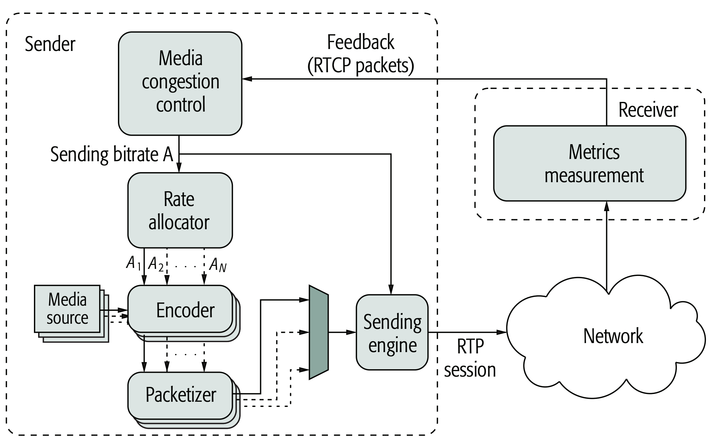

################################
WebRTC RTP Congestion Control
################################

.. include:: ../links.ref
.. include:: ../tags.ref
.. include:: ../abbrs.ref

============ ==========================
**Abstract** WebRTC RTP 拥塞控制
**Authors**  Walter Fan
**Status**   WIP
**Updated**  |date|
============ ==========================

.. |date| date::

.. contents::
   :local:

简介
=========================
视频会议需要低延迟和高带宽

* 基于延迟的控制器 delay-based controller
* 基于丢包的控制器 loss-based controller

基本架构
=========================

在发送方，根据 RTCP Receiver Report 中的 faction lost 得知丢包率，可以调整发送的码率

在接收方，根据 RTP 包到达的时间延迟，通过 arrival time filter, 估算出网络延迟 m(ti), 经过 over-user detector 来判断当前网络的拥塞情况， 再由 Remote rate controller 根据规则计算出最大码率 Ar, 通过 RTCP REMB 消息将 Ar 发回给发送方。 发送方再由 A_s, A_r 和配置，计算出目标的码率 A, 应用到 Encoder 和 Packed Sender 来控制发送方的码率。

.. figure:: ../_static/gcc-architecture.png
   :scale: 90 %
   :alt: gcc-architecture
   :align: center

   GCC Architecture

术语
=========================
* RMCAT: RTP Media Congestion Avoidance Techniques 即 RTP 媒体拥塞避免技术
  
* Queuing Delay 排队延迟

* Delay gradient 延迟梯度

* Kalman filter 卡尔曼滤波

* inter-depature delta time

* inter-arrival delta time

* inter-group delay variation

* GCC: Google Congestion control 谷歌拥塞控制
  
* BBR: Bottleneck Bandwidth and Round-trip propagation time 瓶颈带宽和往返传播时间

* PCC: Performance-oriented Congestion Control 基于性能的拥塞控制

* TCC: Transport-wide Congestion Control 传输带宽控制

* REMB: Receiver Estimated Maximum Bitrate 接收端估计最大比特率

* Starvation: 饥饿，如果某个传输通道由于其他传输通道抢占了带宽而没有得到流量，称为饥饿

交互式实时媒体的拥塞控制的需求
============================================

基本要求：在最多几百毫秒之内，接收方能够连贯流畅地听到或看到发送方的声音，图像或视频。

具体要求, 参见 [#]_ `RFC8836`_

1. 拥塞控制算法必须尝试为交互式实时流量提供尽可能低的延迟传输，同时仍然提供有用的带宽量。
 
2. 该算法必须对其他流公平，包括实时流（例如自身的其他实例）和 TCP 流，包括长期存在的流和突发流量，例如典型的 Web 浏览会话生成的流量。

3. 该算法不应该由于竞争带宽而使得 TCP 流饥饿，并且应该尽可能避免 TCP 流饥饿

4. 该算法应该尽快适应流开始时的初始网络条件。

5. 如果 RTP 流停止或不连续时（例如，当使用 VAD 语音活动检测时），算法应该是稳定的。

6. 在可能的情况下，当 RTP 流共享一个公用的瓶颈时，算法应该综合考虑在两个端点之间发送的多个 RTP 流之间的信息，无论这些流是否复用相同的端口。
   
7. 该算法不应该需要来自网络元素的任何特殊支持才能传达与拥塞相关的信息。

8. 由于这里假设是一组 RTP 流，反向通道通常应该通过 RTP 控制协议 (RTCP) 完成

9. 由该算法管理的流和在瓶颈处相互竞争的流可能具有不同的差分服务代码点 (DSCP) [#]_ [RFC5865] 标记，具体取决于流量类型，或者可能受基于流的 QoS 的约束。

10. 该算法应该将反向信道(backchannel)信息的意外缺失, 感知为信道过度使用问题的可能指示，并相应地做出反应, 以避免导致拥塞崩溃的突发事件。

11. 当应用主动队列管理 (AQM: Active Queue Management) 算法时，该算法应该是稳定的并保持低延迟。另请注意，这些算法可能适用于瓶颈中的多个队列或单个队列。

标准化状况和存在的问题
========================================================================================
参见由 [#]_ “Luca De Cicco, Gaetano Carlucci, and Saverio Mascolo” 所撰写的文章

.. epigraph:: 
   
   The suggested approach is to multiplex all the RTP packet streams in a single RTP session sent over one transport layer flow to reduce the number of flows to be handled by NATs. 
   
   Following this approach, the Media Congestion Control algorithm computes the total sending rate A for the aggregated RTP session based on a set of metrics measured at the receiver and sent back
   through RTCP packets. 
   
   A rate allocation module allocates a fraction Ai of the total bitrate A to each media stream. In particular, each media stream is compressed at a target encoding rate  Ai  such that the sum of all these rates equals the computed sending rate A. 
   
   The media streams are then multiplexed over a single RTP session that feeds a sending engine. This module is responsible for sending the RTP packets to the network at a rate as close as possible to the rate computed by the congestion control algorithm. 
   
   It is worth noting that the placement of the congestion control algorithm is not specified and
   could be sender-side, receiver-side, or distributed both at sender and receiver. 
   
   As an example, Fig. 1 shows the case where the congestion control algorithm is placed only at the sender. The receiver is required to implement a module that  measures metrics to be fed back to the congestion control algorithm through RTCP packets.

.. csv-table:: WEBRTC media flow requirements
   :header: "", "Requirement"
   :widths: 30, 30

   延迟 Latency, 尽可能低于 100ms 
   丢包 Packet losses, "越少越好，可应用 FEC"
   吞吐量 Throughput, 越高越好
   突发性 Burstiness, 要产生一个平滑的发送速率
   公平性 Fairness, 应在实时媒体流和数据流之间公平地分享带宽
   饥饿  Starvation, 媒体流不应由于过度竞争而使TCP 流饥饿
   网络支持 Network support, 无需特别的网络支持即可运行

目标
------------------
the goal of the congestion control algorithm is to produce a sending rate as close as possible to the available end-to-end bandwidth while maintaining the queue occupancy as low as possible.

Additionally, media flows generated by WebRTC applications should fairly share network bandwidth with other concurrent flows. 

设计
------------------

The design of an algorithm meeting these requirements is faced with several choices
with respect to

1. The transport protocol 传输协议
2. Congestion detection 拥塞检测
3. The actuation mechanism to be employed 

The approaches to detect congestion through end-to-end measurements can be divided into
two main categories:

1. Loss-based algorithms, detecting congestion based on packet loss events
2. Delay-based algorithms, detecting congestion based on latency measurements.

Congestion detection can be either implicit,when based on end-to-end measurements performed at the end-points, or explicit, when congestion is measured directly in network elements by monitoring the router buffers lengths.

Delay-based algorithms are preferred to loss-based algorithms due to two reasons: 

* first, delay-based schemes can detect congestion before packets are lost due to buffer overflows; 
* second, loss based algorithms cannot control queuing delays since they continuously probe for the network available bandwidth by filling and draining Internet buffers, generating significant delay variations. 

Notice that explicitly controlling queuing delays is necessary, since excessively large buffers may
lead to latencies of the order of seconds [2]. 
An important issue to be taken into account is to prevent delay-based flows from being starved when
competing with loss-based flows in the best-effort Internet [7]. 
Congestion control algorithms may complement end-to-end measurements with explicit congestion signals sent from network elements to end-points through, for instance, the use of the explicit congestion notification (ECN) mechanism.

.. raw:: html

    

.. role:: red

Concerning the actuation mechanism, the congestion control algorithm can either compute a :red:`congestion window` (window-based approach) or explicitly compute a :red:`sending rate` (rate-based approach). 

**The use of rate-based mechanisms makes it possible to directly use the rate computed by the congestion control algorithm to drive the media encoders, whereas in the case of window-based algorithms, a proper conversion from a window to a rate should be performed.**

关键指标
------------------
* 来往时间 Round-Trip Time
* 单向延迟 One-Way Delay

.. sidebar:: Late comer effect
   :subtitle: this technique might be affected by the so-called “late comer effect
  
   when two flows share the same bottleneck, the flow that arrives later typically
   starves the first one. 
   
   This is due to the fact that the last flow arriving at the bottleneck measures a minimum one-way delay that also accounts for the queuing delay of the existing flow. 
   
   At the same time, the first flow measures an increasing one-way delay due to the presence of the arriving flow. At this point, the first flow yields bandwidth resources to the second flow, which eventually starves the first flow. 

* 单向延迟变化 One-Way Delay Variation (OWDV)

.. figure:: ../_static/rtp_packet_skew.png
   :scale: 50 %
   :alt: packet transmission delay
   :align: center

   packet transmission delay

.. code-block::

   # 发送间隔与到达时间之间的延时
   d(i) = t(i) – t(i-1) – (T(i) – T(i-1))

RTP 头里带的 timestamp 是根据采样所算的步进, 接收方和发送方的时钟偏移可以不予考虑，因为计算的两个包之间在双方间隔之差，偏移时间可相互抵消。

有三种情况:

1. OWDV > 0: 排队延迟在增长
2. OWDV < 0: 排队延迟在减小
3. OWDV = 0: 排队延迟保持在一个恒定的值:
   
  - 拥塞队列是空的：发送速率小于传输能力，不需要排队
  - 拥塞队列是满的：发送速率大于传输能力，排队堵住了
  - 拥塞队列是空的：发送速率等于传输能力，排队有序通过

第 3 种情况下，队列保持不变，OWDV 介于零和其最大值之间。 这是一种称为站立队列的不良情况，它会不断延迟传入流量。 
因此，为了在充分利用可用带宽的同时保证较小的队列占用，算法必须通过增加其发送速率来持续探测可用带宽，直到检测到正排队延迟变化。 此时，发送速率应迅速降低。 总而言之，需要引入一些排队延迟来运行基于延迟变化的拥塞控制算法。

已有三种算法提出来

1. Google Congestion Control (GCC) by Google
   它被应用于 Chrome 浏览器，是相对比较成熟的算法，详见 
   * `GCC 算法详解 <webrtc_gcc.html>`_
   * `REMB 简介 <webrtc_remb.html>`_ 
   * `TCC 算法详解 <webrtc_tcc.html>`_

2. Network Assisted Dynamic Adaptation(NADA) by Cisco

3. Self-Clocked Rate Adaptation for Multimedia(SCReAM) by Ericsson

.. csv-table:: WEBRTC media flow requirements
   :header: "Feature", "GCC", "NADA", "SCReAM"
   :widths: 25, 25, 25, 25

   Metrics, "One-way delay variation,loss ratio", "One-way delay, loss ratio", "One-way delay, loss ratio"
   Architecture, Sender-side or hybrid, Sender-side, Sender-side
   Actuation mechanism, Rate-based, Rate-based, Window-based
   Network support, None, "ECN, PCN", ECN
   Implementation status: Google Chrome, Ns-2 and Ns-3 simulators, OpenWebRTC and simulator
   Codec interaction, VP8 and VP9, Simulated encoder, OpenH264 and VP9

验证方法
==========================
基于 RFC5033 Specify New Congestion Control Algorithms 和 RFC5166 Metrics for the Evaluation of Congestion Control algorithms, 在 RFC8868 中提出了对于拥塞控制算法的验证方法.

RFC8867 提出了基本的测试用例在, RFC8869 也提高了无线网络测试场景中的测试用例.

度量指标
-------------------------

#. Sending rate, receiver rate, goodput (measured at 200ms intervals)
#. Packets sent, packets received
#. Bytes sent, bytes received
#. Packet delay
#. Packets lost, packets discarded (from the playout or de-jitter buffer)
#. If using retransmission or FEC: post-repair loss
#. Self-fairness and fairness with respect to cross traffic:

#. Convergence time: The time taken to reach a stable rate at startup, after the available link capacity changes, or when new flows get added to the bottleneck link.

#. Instability or oscillation in the sending rate: The frequency or number of instances when the sending rate oscillates between an high watermark level and a low watermark level, or vice-versa in a defined time window. For example, the watermarks can be set at 4x interval: 500 Kbps, 2 Mbps, and a time window of 500 ms.

#. Bandwidth utilization, defined as the ratio of the instantaneous sending rate to the instantaneous bottleneck capacity: This metric is useful only when a congestion-controlled RTP flow is by itself or is competing with similar cross-traffic.

From the logs, the statistical measures (min, max, mean, standard deviation, and variance) for the whole duration or any specific part of the session can be calculated. Also the metrics (sending rate, receiver rate, goodput, latency) can be visualized in graphs as variation over time; the measurements in the plot are at one-second intervals. Additionally, from the logs, it is possible to plot the histogram or cumulative distribution function (CDF) of packet delay

RTP Log Format 日志格式
-----------------------------
Having a common log format simplifies running analyses across different measurement setups and comparing their results.

.. code-block::

   Send or receive timestamp (Unix): <int>.<int>  -- sec.usec decimal
   RTP payload type                  <int>        -- decimal
   SSRC                              <int>        -- hexadecimal
   RTP sequence no                   <int>        -- decimal
   RTP timestamp                     <int>        -- decimal
   marker bit                        0|1          -- character
   Payload size                      <int>        -- # bytes, decimal

网络参数
----------------------------

1. One-Way Propagation Delay
~~~~~~~~~~~~~~~~~~~~~~~~~~~~~~~~~~~~

2. End-to-End Loss
~~~~~~~~~~~~~~~~~~~~~~~~~~~~~~~~~~~~

3. Drop-Tail Route Queue Length
~~~~~~~~~~~~~~~~~~~~~~~~~~~~~~~~~~~~

4. Loss Generation module
~~~~~~~~~~~~~~~~~~~~~~~~~~~~~~~~~~~~

5. Jitter modules
~~~~~~~~~~~~~~~~~~~~~~~~~~~~~~~~~~~~

6. Traffic Models
~~~~~~~~~~~~~~~~~~~~~~~~~~~~~~~~~~~~

参考资料
=========================

* `Analysis and Design of the Google Congestion Control for WebRTC <https://c3lab.poliba.it/images/6/65/Gcc-analysis.pdf>`_

* `RFC8825`_: Overview: Real-Time Protocols for Browser-Based Applications
* `RFC8836`_: Congestion Control Requirements for Interactive Real-Time Media
* `RFC8083`_: Multimedia Congestion Control: Circuit Breakers for Unicast RTP Sessions

* `RMCAT documents`_: RTP Media Congestion Avoidance Techniques documents

* H. Alvestrand, “RTCP Message for Receiver Estimated Maximum Bitrate,” Internet-Draft draft-alvestrand-rmcat-remb-03 (work in progress), Oct. 2013.

* B. Briscoe et al., “Reducing Internet Latency: A Survey of Techniques and Their Merits,” IEEE Commun. Surveys Tutori- als, vol. 18, no. 3, 2016, pp. 2149–96.

* G. Carlucci et al., “Analysis and Design of the Google Congestion Control for Web Real-time Communication (WebRTC),” Proc. ACM Multimedia Systems Conf., Klagen- furt, Austria, May 2016.

* I. Johansson, “Self-clocked Rate Adaptation for Conversa- tional Video in LTE,” Proc. 2014 ACM SIGCOMM Wksp. Capacity Sharing Workshop, Chicago, USA, Aug. 2014, pp. 51–56.

* S. Loreto and S. P. Romano, “Real-Time Communications in the Web: Issues, Achievements, and Ongoing Standardiza- tion Efforts,” IEEE Internet Computing, vol. 16, no. 5, Sept. 2012, pp. 68–73.

* C. Perkins and V. Singh, “Multimedia Congestion Control: Circuit Breakers for Unicast RTP Sessions,” RFC 8083, RFC Editor, Mar. 2017.

* J Randell and Z. Sarker, “Congestion Control Requirements for RMCAT,” Internet-Draft draft-ietf-rmcat-cc-require- ments-09 (work in progress), Dec. 2014.

* Z. Sarkeret al., “RTP Control Protocol (RTCP) Feedback for Congestion Control,” Internet-Draft draft-dt-rmcat-feedback- message-01 (work in progress), Oct. 2016.

* Z. Sarker et al., “Test Cases for Evaluating RMCAT Propos- als,” Internet-Draft draft-ietf-rmcat-eval-test-04 (work in prog- ress), Oct. 2016.

* D. Singer and H. Desineni, “Transmission Time Offsets in RTP Streams,” RFC 5450, RFC Editor, Mar. 2009.

* M. Welzl, S. Islam, and S. Gjessing, “Coupled Congestion Control for RTP Media,” Internet-Draft draft-ietf-rmcat-cou- pled-cc-06 (work in progress), Mar. 2017.

* X. Zhu et al., “NADA: A Unified Congestion Control Scheme for Real-Time Media,” Internet-Draft draft-ietf-rmcat- nada-04 (work in progress), Mar. 2017.

.. [#] `RFC8836`_: Congestion Control Requirements for Interactive Real-Time Media
.. [#] `Congestion Control for WebRTC: Standardization Status and Open Issues <https://ieeexplore.ieee.org/stamp/stamp.jsp?tp=&arnumber=7992924>`_

.. [#] `RFC5865`_ A Differentiated Services Code Point (DSCP) for Capacity-Admitted Traffic

.. _RMCAT documents: https://datatracker.ietf.org/wg/rmcat/documents/