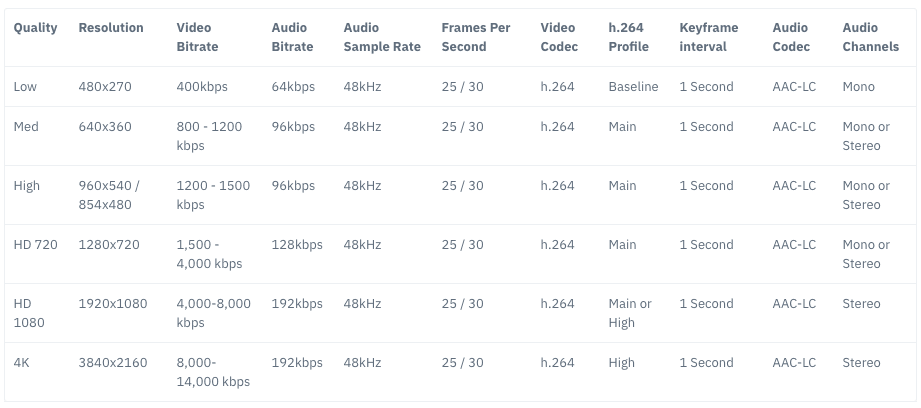

:orphan:

################################
REMB
################################

.. include:: ../links.ref
.. include:: ../tags.ref
.. include:: ../abbrs.ref

============ ==========================
**Abstract** WebRTC REMB
**Authors**  Walter Fan
**Status**   WIP
**Updated**  |date|
============ ==========================

.. |date| date::

.. contents::
   :local:

1) What  - REMB 是什么？
==================================================

`Receiver Estimated Max Bitrate (REMB) <https://tools.ietf.org/html/draft-alvestrand-rmcat-remb-03>`_ 是一种RTCP 反馈消息，作为接收方，告诉发送方它可以接收的带宽是多少

根据 `RFC4585`_ 中的定义，它属于 PSFB(Payload Specific FeedBack) 消息，其 payload  type 为 206， fmtType 为15.

它描述了一个绝对值时间戳选项，用于带宽估计。该反馈消息用于通知一个在同一RTP会话上有多个媒体流的发送方, 通知它在该RTP会话的接收方路径上的总的估计可用比特率。

在用于反馈消息的公共数据包头中（如[RFC4585]的6.1节所定义），“数据包发送者的SSRC” 字段指示通知的来源。 不使用“媒体源的SSRC”，并且应将其设置为0。在其他RFC中也使用零值。

媒体发送方对符合此规范的REMB消息的接收将导致该消息在RTP会话上发送的总比特率等于或低于此消息中的比特率。 新的比特率限制应尽快应用。 发送者可以根据自己的限制和估计自由应用其他带宽限制。

2) Why 为什么要有 REMB？
==================================================

发送者不知道接收方的带宽情况，它需要有一个机制由接收方告诉它有多少带宽可供传输, 这样发送方可以根据这个估计的带宽来调整分辨率(90p, 180p, 360p, 720p等)和帧率(每秒24, 30, 40, 60帧等)

      不同分辨率所使用的带宽

3) How 怎么实现 REMB？
==================================================

* 1. SDP 中包含如下属性

.. code-block::

    a=rtcp-fb:<payload type> goog-remb
    a=extmap:3 http://www.webrtc.org/experiments/rtp-hdrext/abs-send-time
    

* 2. RTCP 消息

RTCP 消息格式如下:

* 首先看它的 Payload Type，206 意谓 PSFB 即荷载特定的反馈 Payload-specific Feedback, 参见 [http://www.rfcreader.com/#rfc5104](http://www.rfcreader.com/#rfc5104) Codec Control Feedback 编码层反馈
* 其次看它的 FMT type, 15 意谓应用层反馈 Application layer feedback
* 然后看它的 Unique Identifier 唯一标识符 “REMB”
* 最后看相关的 SSRC number, 即RTP流个数，计算估计出带宽为 `mantissa * 2 ^ exp`

.. code-block::

    0                   1                   2                   3
    0 1 2 3 4 5 6 7 8 9 0 1 2 3 4 5 6 7 8 9 0 1 2 3 4 5 6 7 8 9 0 1
   +-+-+-+-+-+-+-+-+-+-+-+-+-+-+-+-+-+-+-+-+-+-+-+-+-+-+-+-+-+-+-+-+
   |V=2|P| FMT=15  |   PT=206      |             length            |
   +-+-+-+-+-+-+-+-+-+-+-+-+-+-+-+-+-+-+-+-+-+-+-+-+-+-+-+-+-+-+-+-+
   |                  SSRC of packet sender                        |
   +-+-+-+-+-+-+-+-+-+-+-+-+-+-+-+-+-+-+-+-+-+-+-+-+-+-+-+-+-+-+-+-+
   |                  SSRC of media source                         |
   +-+-+-+-+-+-+-+-+-+-+-+-+-+-+-+-+-+-+-+-+-+-+-+-+-+-+-+-+-+-+-+-+
   |  Unique identifier 'R' 'E' 'M' 'B'                            |
   +-+-+-+-+-+-+-+-+-+-+-+-+-+-+-+-+-+-+-+-+-+-+-+-+-+-+-+-+-+-+-+-+
   |  Num SSRC     | BR Exp    |  BR Mantissa                      |
   +-+-+-+-+-+-+-+-+-+-+-+-+-+-+-+-+-+-+-+-+-+-+-+-+-+-+-+-+-+-+-+-+
   |   SSRC feedback                                               |
   +-+-+-+-+-+-+-+-+-+-+-+-+-+-+-+-+-+-+-+-+-+-+-+-+-+-+-+-+-+-+-+-+
   |  ...                                                          |

字段含义

* 版本 version (V): (2 bits):    RTP 当前的版本为 2.

 - 是否填充 padding (P) (1 bit):   If set, the padding bit indicates that the   packet contains additional padding octets at the end that   are not part of the control information but are included  in the length field.  Always 0.

* 反馈消息类型 Feedback message type (FMT) (5 bits):  This field identifies the type  of the FB message and is interpreted relative to the type   (transport layer, payload- specific, or application layer  feedback).  Always 15, application layer feedback  message.  [RFC 4585 section 6.4](https://tools.ietf.org/html/rfc4585#section-6.4).

* 荷载类型： Payload type (PT) (8 bits):   
This is the RTCP packet type that identifies the packet as being an RTCP FB message.   Always PSFB (206), Payload-specific FB message.  [RFC 4585  section 6.4](https://tools.ietf.org/html/rfc4585#section-6.4).

* 长度 Length (16 bits): 这个包的总长度（32bit）-1， 包括包头和填充值
The length of this packet in 32-bit words minus  one, including the header and any padding.  This is in line with the definition of the length field used in RTCP  sender and receiver reports [3].  [RFC 4585 section 6.4](https://tools.ietf.org/html/rfc4585#section-6.4).

* 包发送者的同步源： SSRC of packet sender (32 bits):  The synchronization source identifier for the originator of this packet.  [RFC 4585 section 6.4](https://tools.ietf.org/html/rfc4585#section-6.4).

* 媒体源的 SSRC 值：  SSRC of media source (32 bits):  Always 0; this is the same convention as in [[RFC5104] section 4.2.2.2](https://tools.ietf.org/html/rfc5104#section-4.2.2.2) (TMMBN).

* 唯一的标识符 Unique identifier (32 bits):  Always 'R' 'E' 'M' 'B' (4 ASCII characters).

* 同步源的个数 Num SSRC (8 bits):  Number of SSRCs in this message.

* 带宽的指数 BR Exp (6 bits):   The exponential scaling of the mantissa for the  maximum total media bit rate value, ignoring all packet  overhead.  The value is an unsigned integer [0..63], as in [RFC 5104 section 4.2.2.1](https://tools.ietf.org/html/rfc5104#section-4.2.2.1).

* 带宽的底数 BR Mantissa (18 bits):   The mantissa of the maximum total media bit rate (ignoring all packet overhead) that the sender of the REMB estimates.  The BR is the estimate of the traveled path for the SSRCs reported in this message.  The value is an unsigned integer in number of bits per  second.

* 所反馈的SSRC 一个或多个值 SSRC feedback (32 bits)  Consists of one or more SSRC entries which this feedback message applies to.

最终计算出来的带宽估计为

.. math::

    receiver-bit-rate = mantissa * 2^exp
    

4) Example 
===================================

REMB 的实现可以参考 webrtc 的源码： `remb.cc`_

带宽的计算代码为 

.. code-block:: c

    uint8_t exponenta = payload[13] >> 2;
    uint64_t mantissa = (static_cast<uint32_t>(payload[13] & 0x03) << 16) |
                        ByteReader<uint16_t>::ReadBigEndian(&payload[14]);
    bitrate_bps_ = (mantissa << exponenta);

5) Conclusion
======================

网络状况变化多端，时好时坏，在发送音视频不能由着性子随便发，需要根据接收者反馈的 RTCP 消息中包含的最大带宽估计调整自己的发送采样率/分辨率/帧率，也就是调整发送的码率，以满足基本的通信需求。

.. _remb.cc: (https://source.chromium.org/chromium/chromium/src/+/master:third_party/webrtc/modules/rtp_rtcp/source/rtcp_packet/remb.cc